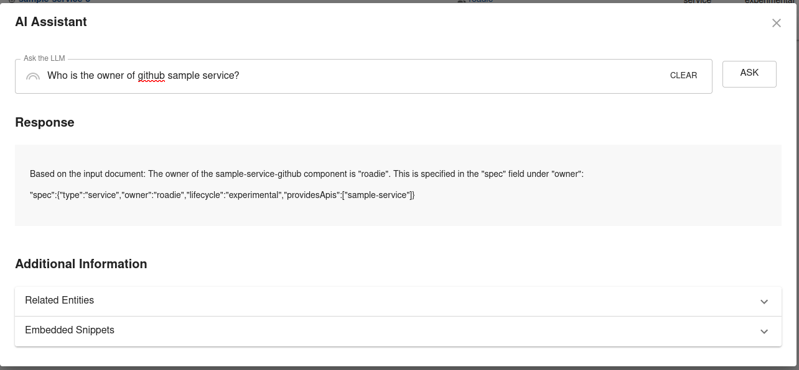
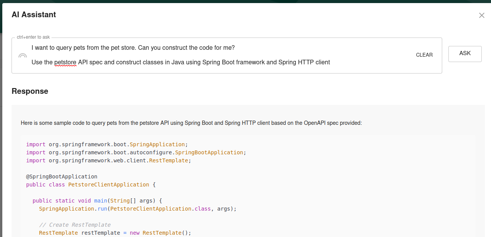

# Kozmo RAG AI Frontend plugin for Backstage

This plugin is the frontend for RAG AI Backstage plugin. You can see the corresponding backend plugin in [here](/plugins/backend/rag-ai-backend/README.md).


## Getting started

The plugin exposes a single Modal React component which can be triggered on the application UI by pressing `ctrl+,` (control + comma).


You can ask the plugin information about your catalog and request assistance on how to better interact with the catalog entities that have been configured to your system. The plugin provides functionality to call the RAG AI backend, which enhances your queries with additional context and requests responses from configured LLMs to provide answers based on that context.



Depending on how you implement your Embeddings providers and retrieval functionality, you can use the LLM, for example, to construct specific code samples from your Catalog Entity API endpoints, while using the wider knowledge of specific best practices from various programming languages and frameworks.



## Configuration

To configure the frontend plugin, you need to do two things:

- Create an API client for the frontend plugin
- Add the exposed UI element into the application

### Creating an API client

The RAG AI plugin exposes an API client which needs to be configured for your Backstage application frontend to be able to use the RAG AI functionality. You can do that by adding a new API factory into your `apis.ts` file. See configuration example below:

```ts
// packages/app/src/apis.ts

import {
  AnyApiFactory,
  configApiRef,
  createApiFactory,
  discoveryApiRef,
  fetchApiRef,
  identityApiRef,
} from '@backstage/core-plugin-api';
import fetch from 'cross-fetch';
import { ragAiApiRef, KozmoRagAiClient } from '@kozmoai/rag-ai';

export const apis: AnyApiFactory[] = [
  // ... Other APIs
  createApiFactory({
    api: ragAiApiRef,
    deps: {
      configApi: configApiRef,
      discoveryApi: discoveryApiRef,
      fetchApi: fetchApiRef,
      identityApi: identityApiRef,
    },
    factory: ({ discoveryApi, fetchApi, configApi, identityApi }) => {
      return new KozmoRagAiClient({
        discoveryApi,
        fetchApi,
        configApi,
        identityApi,
      });
    },
  }),
];
```

### Adding the UI components into the application

The plugin exposes a single UI component which is used to communicate with the application Backend. You can register this

App.tsx

```tsx

// packages/app/src/App.tsx
import { RagModal } from '@kozmoai/rag-ai';

...
const App = () => (
  <AppProvider>
    <AlertDisplay />
    <OAuthRequestDialog />
    <AppRouter>
      <RagModal />
      <Root>{routes}</Root>
    </AppRouter>
  </AppProvider>
);
```
