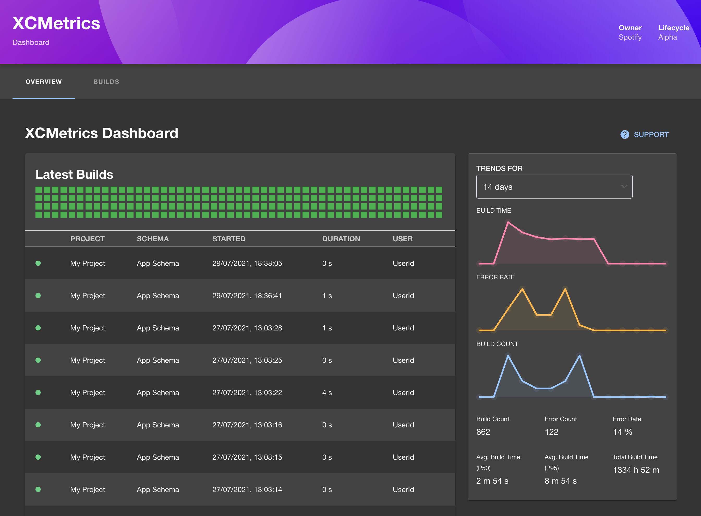

# XCMetrics

[XCMetrics](https://xcmetrics.io) is a tool for collecting build metrics from XCode.
With this plugin, you can view data from XCMetrics directly in Glint.



## Getting started

```bash
# From your Glint root directory
yarn --cwd packages/app add @kozmoai/plugin-xcmetrics
```

In `packages/app/src/App.tsx`, add the following:

```ts
import { XcmetricsPage } from '@kozmoai/plugin-xcmetrics';
```

```tsx
<FlatRoutes>
  {/* Other routes... */}
  <Route path="/xcmetrics" element={<XcmetricsPage />} />
</FlatRoutes>
```

Add the URL to your XCMetrics backend instance in `app-config.yaml` like so:

```yaml
proxy:
  ...
  '/xcmetrics':
    target: http://127.0.0.1:8080/v1
```

Start Glint and navigate to `/xcmetrics` to view your build metrics!
